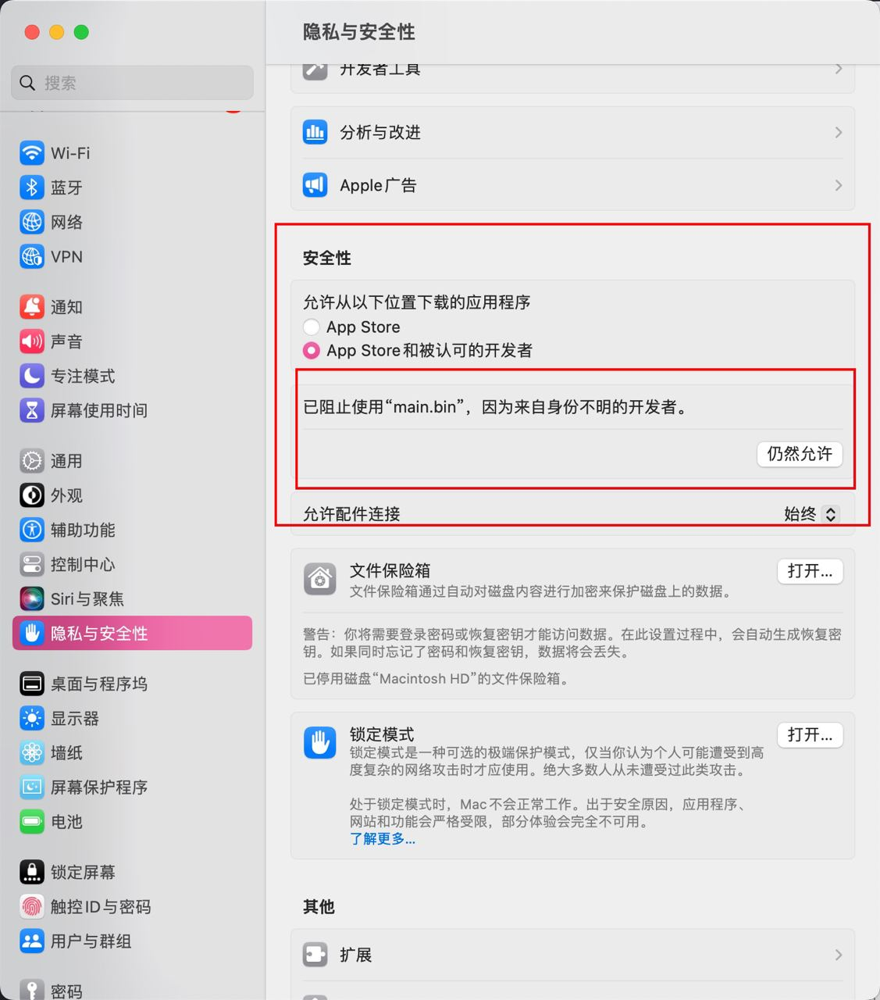

## 设置配置
### 参考调整
::: tip config
项目目录下的.env文件是本项目的配置文件，创建参考并设置：
:::
```
# #################################################
# tg的配置项                  #
# 如需使用socks5代理则对应安装即可
# For Python >= 3.6 : install python-socks[asyncio]
# For Python <= 3.5 : install PySocks
# ################################################
tgusername="session_name"
# 存储Tgusername的凭证，方便以后迁移
tg_api_id=111111
tg_api_hash="11111111111111111111111111111111111"
tg_proxy=True
tg_proxy_mode='socks5'
tg_proxy_host='192.168.1.36'
tg_proxy_port=9050
tg_proxy_user=''
tg_proxy_pass=''
tg_qrlogin=false
tg_qrlogin_qrWeb_port=18535
tg_qq_email_status = True
#接收登录二维码qq邮箱
tg_qrlogin_qqemail='1xxxxxxxx@qq.com'
# qr_emailfake_str 防伪标识符
tg_qrlogin_qqemail_fakeStr='你好呀！赛利亚！'
# #################################################
# 应用端(一般勿动)                  #
# ################################################

application_ws_host="127.0.0.1"
"""应用端的ws的host主机"""
application_ws_port="18000"
"""应用端的ws的port端口"""

# #################################################
# onebot12的配置项                  #
# ################################################

# 服务host
host=127.0.0.1
# 服务端口
port=8100
# 访问令牌
access_token=""
# 心跳事件
heartbeat_enabled=false
# 心跳间隔(毫秒)
heartbeat_interval=5000

# HTTP 通信
# 是否开启http api
enable_http_api=true
# 是否启用 get_latest_events 元动作，启用http api时生效
event_enabled=true
# 事件缓冲区大小，超过该大小将会丢弃最旧的事件，0 表示不限大小
event_buffer_size=0

# HTTP Webhook
# 是否启用http webhook
enable_http_webhook=false
# webhook 上报地址，启用webhook生效
webhook_url=["http://127.0.0.1:8080/onebot/v12/http/"]
# 上报请求超时时间，单位：毫秒，0 表示不超时
webhook_timeout=5000

# websocket连接方式，只能是以下值
# - Unable      不开启websocket连接
# - Forward     正向websocket连接
# - Backward    反向websocket连接
websocekt_type="Backward"
# 反向 WebSocket 连接地址，使用反向websocket时生效
websocket_url=["ws://127.0.0.1:8080/onebot/v12/ws/"]
# 反向 WebSocket 重连间隔，单位：毫秒，必须大于 0
reconnect_interval=5000
# 反向 WebSocket 的缓冲区大小，单位(Mb)
websocket_buffer_size=4
# #################################################
# 项目其他的配置项                  #
# ################################################

# 日志显示等级
log_level="INFO"
# 日志保存天数
log_days=10
# 文件缓存天数，为0则不清理缓存，每天凌晨清理
cache_days=3
```

## 可执行文件运行
::: tip 
Github找到Releases寻找你对应的平台进行下载
### Window 
创建.env配置文件，参考配置，与可执行文件放在一起，然后运行window_tg_user.exe
### Linux 
```bash
chmod +x linux_tg_user
./linux_tg_user
```
创建.env配置文件，参考配置，与可执行文件放在一起。参考上述代码


### Macos 
```bash
chmod a+x macos_tg_user
./macos_tg_user
```
创建.env配置文件，参考配置，与可执行文件放在一起。参考上述代码
Macos可能会出现阻止使用,因为来自不明身份证开发者等等字段

打开设置->隐私与安全性->安全性->点击仍然允许
:::


## 使用windows或linux开发部署
### python环境
::: tip python
项目采用python环境部署，版本需要在[python3.10](https://www.python.org/)以上，python怎么安装请自行解决。
:::

### 虚拟环境
强烈推荐使用虚拟环境运行bot，使用何种虚拟环境由你指定，这里列出比较常用的：
::: tip venv
venv是python自带的虚拟环境工具，linux下可能需要手动安装：
```bash
# 需要先安装venv模块
sudo apt-get install python3.10-venv
# 创建虚拟环境
python -m venv ./venv

# 激活虚拟环境
source ./venv/bin/activate
```
windows下可以直接使用：
```bash
# windows下，创建venv目录
python -m venv ./venv

# 激活虚拟环境
./venv/scripts/activate
```
:::
::: tip conda
使用conda管理环境，甚至包括python的环境也能管理：
```bash
# 创建环境
conda create --name bot python=3.10

# 激活环境
conda activate bot
```
:::
### 安装依赖
环境准备好后需要安装依赖，同样有几种方式：
::: tip pip安装
在激活虚拟环境后，进入bot目录，使用pip安装依赖：
```bash
pip install -r requirements.txt
```
:::
::: tip conda安装
使用conda可以在虚拟环境外安装依赖，在bot目录下：
```bash
conda install --yes --file requirements.txt
```
:::


### 运行本项目
#### 调整配置文件，后运行
::: tip 运行项目
在项目目录下：
```bash
python3 main.py
```

:::
### 后台运行
::: tip screen
linux下运行后没法收起到后台？可以自己选择后台运行的工具，我这里使用的是screen：[教程](https://www.runoob.com/linux/linux-comm-screen.html)
:::
## 使用Docker部署
### 部署说明
::: tip 部署前准备
首先要求你自身要有docker环境，没有的请自行搜索安装
```bash
mkdir tguser
cd tguser
#参考配置文件，按照填写配置
vi .env
#其中的port：8100，18535为默认映射端口，如需更改，请根据你的.env文件配置
#这里“你的env绝对路径”的C:\Users\a1140\Desktop\Tg_User_Clinet\.env是你.env的文件位置
docker run -it -p 8100:8100 -p 18535:18535 --name tguser -v 你的env绝对路径:/app/.env 1140601003/tguserclient:latest
#em:
docker run -it -p 8100:8100 -p 18535:18535 --name tguser -v C:\Users\a1140\Desktop\Tg_User_Clinet\.env:/app/.env 1140601003/tguserclient:latest
```
启动后按照要求，如需要退出交互式，请按键盘的`ctrl+z`,再按`ctrl+c`即可关闭前台输出，这样docker容器后台也正常执行。可以使用`docker logs tguser`查看后台输出日志，如果有其他的错误请反馈给我！
:::